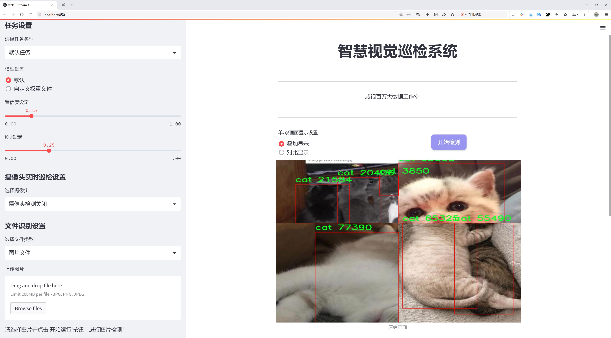
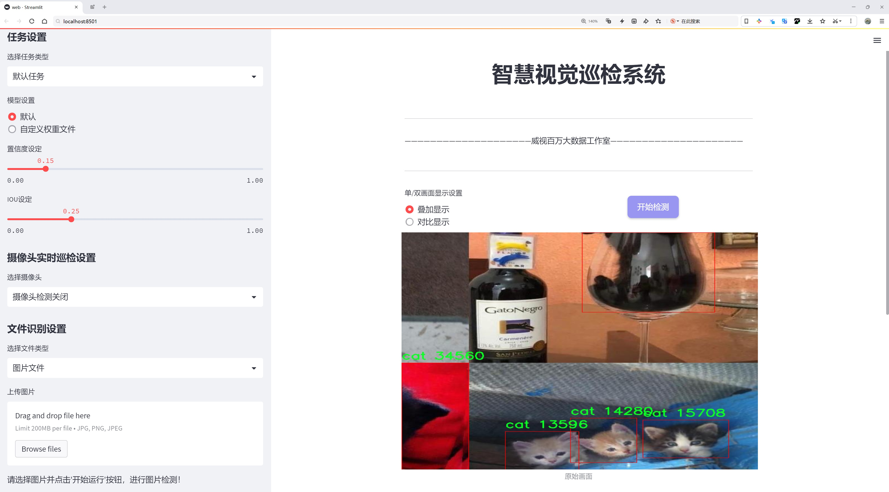
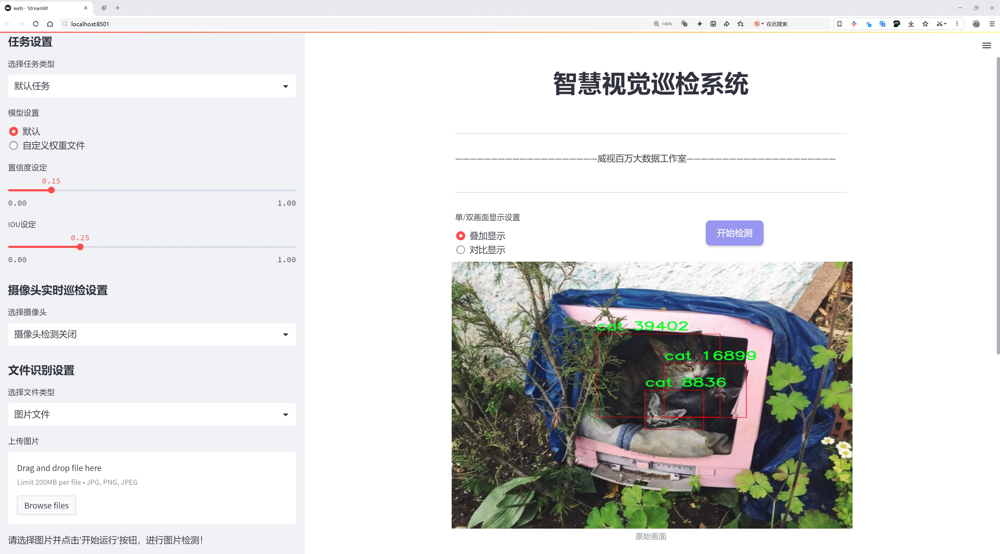
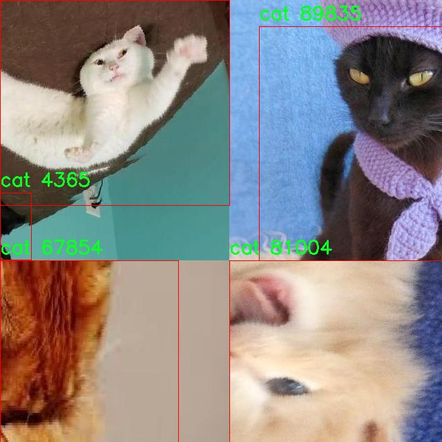
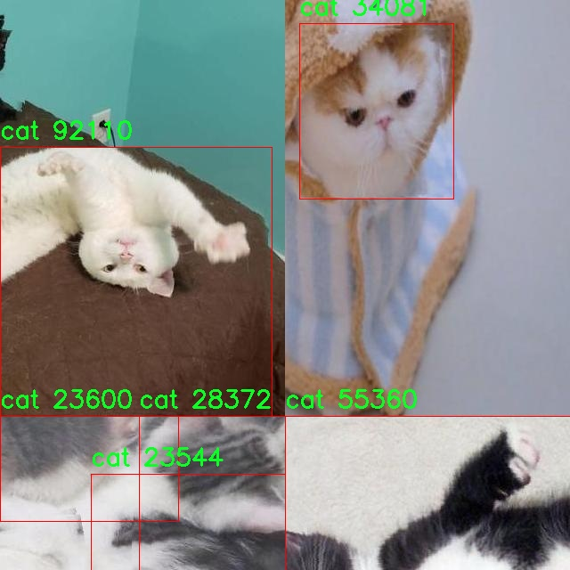
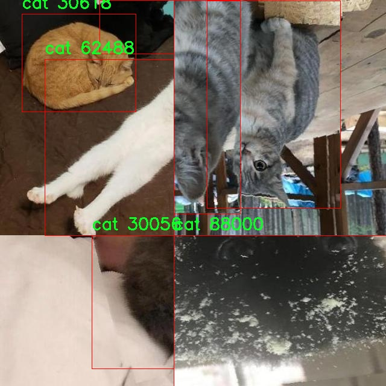
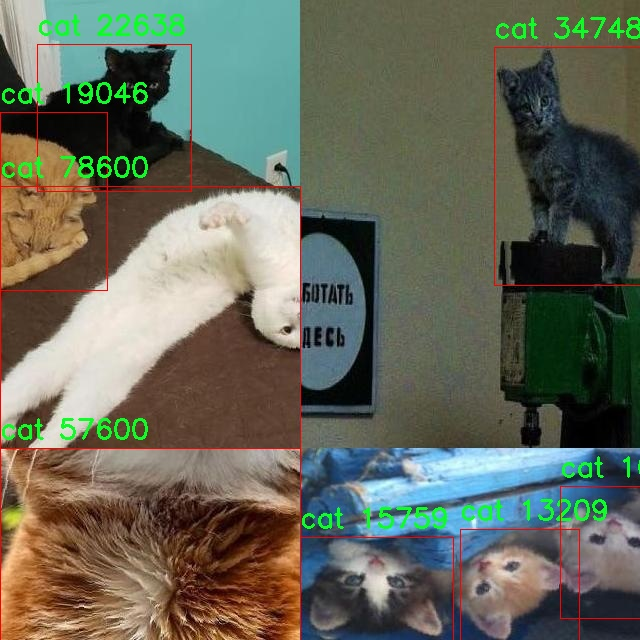

# 猫咪检测检测系统源码分享
 # [一条龙教学YOLOV8标注好的数据集一键训练_70+全套改进创新点发刊_Web前端展示]

### 1.研究背景与意义

项目参考[AAAI Association for the Advancement of Artificial Intelligence](https://gitee.com/qunshansj/projects)

项目来源[AACV Association for the Advancement of Computer Vision](https://gitee.com/qunmasj/projects)

研究背景与意义

随着计算机视觉技术的快速发展，物体检测作为其中一个重要的研究领域，已经在多个应用场景中展现出其巨大的潜力和价值。特别是在宠物监测、动物保护以及智能家居等领域，猫咪作为一种广受欢迎的宠物，其检测与识别的需求日益增加。传统的猫咪检测方法往往依赖于手工特征提取和简单的分类器，难以应对复杂环境下的变化，如光照、姿态和背景的多样性。因此，基于深度学习的物体检测方法逐渐成为研究的热点。

YOLO（You Only Look Once）系列模型以其高效的实时检测能力和较高的准确率，成为物体检测领域的佼佼者。YOLOv8作为该系列的最新版本，进一步提升了模型的性能和应用范围。然而，尽管YOLOv8在多种物体检测任务中表现优异，但在特定领域如猫咪检测中，仍然存在一些挑战。尤其是在数据集的构建和模型的训练过程中，如何有效利用有限的样本数据，提高模型的泛化能力和准确性，是当前研究的关键问题。

本研究旨在基于改进的YOLOv8模型，构建一个高效的猫咪检测系统。我们将使用包含2400张猫咪图像的数据集，该数据集专注于单一类别的猫咪，能够为模型提供相对集中和清晰的训练样本。这一数据集的构建不仅为猫咪检测提供了丰富的视觉信息，也为后续的模型训练和优化奠定了基础。通过对YOLOv8模型的改进，我们将探索如何通过数据增强、特征提取优化以及超参数调整等手段，提升模型在猫咪检测任务中的表现。

本研究的意义在于，不仅为猫咪检测提供了一种新的技术解决方案，也为相关领域的研究提供了参考。通过改进YOLOv8模型，我们期望能够实现更高的检测精度和更快的处理速度，使得猫咪检测系统能够在实际应用中发挥更大的作用。此外，研究成果还可以为其他动物检测、宠物监控等相关领域的研究提供借鉴，推动计算机视觉技术在动物识别和保护中的应用。

综上所述，基于改进YOLOv8的猫咪检测系统的研究，不仅具有重要的学术价值，也具有广泛的应用前景。通过对猫咪这一特定对象的深入研究，我们希望能够为物体检测领域的进一步发展贡献一份力量，同时也为宠物爱好者和动物保护组织提供更为高效的工具和方法，促进人与动物之间的和谐共处。

### 2.图片演示







##### 注意：由于此博客编辑较早，上面“2.图片演示”和“3.视频演示”展示的系统图片或者视频可能为老版本，新版本在老版本的基础上升级如下：（实际效果以升级的新版本为准）

  （1）适配了YOLOV8的“目标检测”模型和“实例分割”模型，通过加载相应的权重（.pt）文件即可自适应加载模型。

  （2）支持“图片识别”、“视频识别”、“摄像头实时识别”三种识别模式。

  （3）支持“图片识别”、“视频识别”、“摄像头实时识别”三种识别结果保存导出，解决手动导出（容易卡顿出现爆内存）存在的问题，识别完自动保存结果并导出到tempDir中。

  （4）支持Web前端系统中的标题、背景图等自定义修改，后面提供修改教程。

  另外本项目提供训练的数据集和训练教程,暂不提供权重文件（best.pt）,需要您按照教程进行训练后实现图片演示和Web前端界面演示的效果。

### 3.视频演示

[3.1 视频演示](https://www.bilibili.com/video/BV1HbtoetErT/)

### 4.数据集信息展示

##### 4.1 本项目数据集详细数据（类别数＆类别名）

nc: 1
names: ['cat']


##### 4.2 本项目数据集信息介绍

数据集信息展示

在本研究中，我们使用了名为“mickey finder”的数据集，以改进YOLOv8模型在猫咪检测任务中的性能。该数据集专注于猫咪这一特定类别，旨在为深度学习模型提供高质量的训练数据，从而提升其在实际应用中的准确性和鲁棒性。数据集的类别数量为1，唯一的类别为“cat”，这意味着所有的数据样本均围绕这一主题进行收集和标注。

“mickey finder”数据集的构建过程经过精心设计，确保了数据的多样性和代表性。数据集中的图像来源于不同的环境和场景，包括室内和室外，白天和夜晚，甚至不同的天气条件。这种多样性使得模型在训练过程中能够学习到猫咪在各种背景下的特征，从而提高其在真实世界应用中的泛化能力。此外，数据集中包含了不同品种、颜色和体型的猫咪，这进一步增强了模型对猫咪外观变化的适应性。

在数据标注方面，所有图像均经过专业标注人员的仔细审核和标注，确保每一只猫咪都被准确地框定和标识。标注的准确性是影响模型性能的关键因素之一，因此我们特别重视这一环节。通过使用高质量的标注工具和严格的审核流程，我们力求为YOLOv8模型提供最优质的训练数据。

数据集的规模也是影响模型训练效果的重要因素。“mickey finder”数据集包含了数千张猫咪图像，足以支撑深度学习模型的训练需求。数据集的大小不仅能够帮助模型学习到丰富的特征，还能在一定程度上缓解过拟合问题。为了进一步提升模型的鲁棒性，我们还采用了数据增强技术，包括图像旋转、缩放、裁剪和颜色调整等，确保模型在面对不同的输入时能够保持良好的检测性能。

在训练过程中，我们将“mickey finder”数据集与YOLOv8模型相结合，利用其先进的特征提取和目标检测能力，旨在实现高效的猫咪检测。YOLOv8作为一种最新的目标检测算法，具有快速的推理速度和较高的检测精度，能够满足实时应用的需求。通过对“mickey finder”数据集的训练，我们期望模型能够在各种复杂场景中准确识别和定位猫咪，为后续的应用开发打下坚实的基础。

综上所述，“mickey finder”数据集为改进YOLOv8的猫咪检测系统提供了丰富的训练资源。其独特的设计理念和高质量的数据标注，使得该数据集在猫咪检测领域具有重要的应用价值。通过对该数据集的深入研究和分析，我们相信能够推动猫咪检测技术的发展，并为相关领域的研究提供有力支持。










### 5.全套项目环境部署视频教程（零基础手把手教学）

[5.1 环境部署教程链接（零基础手把手教学）](https://www.ixigua.com/7404473917358506534?logTag=c807d0cbc21c0ef59de5)


[5.2 安装Python虚拟环境创建和依赖库安装视频教程链接（零基础手把手教学）](https://www.ixigua.com/7404474678003106304?logTag=1f1041108cd1f708b01a)

### 6.手把手YOLOV8训练视频教程（零基础小白有手就能学会）

[6.1 手把手YOLOV8训练视频教程（零基础小白有手就能学会）](https://www.ixigua.com/7404477157818401292?logTag=d31a2dfd1983c9668658)

### 7.70+种全套YOLOV8创新点代码加载调参视频教程（一键加载写好的改进模型的配置文件）

[7.1 70+种全套YOLOV8创新点代码加载调参视频教程（一键加载写好的改进模型的配置文件）](https://www.ixigua.com/7404478314661806627?logTag=29066f8288e3f4eea3a4)

### 8.70+种全套YOLOV8创新点原理讲解（非科班也可以轻松写刊发刊，V10版本正在科研待更新）

由于篇幅限制，每个创新点的具体原理讲解就不一一展开，具体见下列网址中的创新点对应子项目的技术原理博客网址【Blog】：


[8.1 70+种全套YOLOV8创新点原理讲解链接](https://gitee.com/qunmasj/good)

### 9.系统功能展示（检测对象为举例，实际内容以本项目数据集为准）

图9.1.系统支持检测结果表格显示

  图9.2.系统支持置信度和IOU阈值手动调节

  图9.3.系统支持自定义加载权重文件best.pt(需要你通过步骤5中训练获得)

  图9.4.系统支持摄像头实时识别

  图9.5.系统支持图片识别

  图9.6.系统支持视频识别

  图9.7.系统支持识别结果文件自动保存

  图9.8.系统支持Excel导出检测结果数据


### 10.原始YOLOV8算法原理

原始YOLOv8算法原理

YOLOv8作为YOLO系列中的重要一员，继承了前几代模型的设计理念，同时在多方面进行了创新和改进。其核心目标是实现高效的目标检测，尤其是在复杂环境下的应用，如小目标的检测和背景多样性的处理。YOLOv8的设计围绕着几个关键模块展开，包括输入端、主干网络、Neck端和输出端，每个模块都在优化算法性能方面发挥着重要作用。

首先，YOLOv8在数据预处理方面延续了YOLOv5的策略，采用了多种数据增强技术。这些技术包括马赛克增强、混合增强、空间扰动和颜色扰动等，旨在提高模型对不同场景和条件的适应能力。通过这些增强手段，YOLOv8能够在训练过程中生成更加多样化的样本，从而提升模型的泛化能力和鲁棒性。

在主干网络结构方面，YOLOv8对YOLOv5的设计进行了优化，采用了C2f模块替代了原有的C3模块。C2f模块通过引入更多的分支结构，增强了特征提取过程中的梯度流动。这种设计不仅提高了特征的表达能力，还使得网络在反向传播时能够更有效地传递信息，进而提升了模型的整体性能。主干网络通过卷积和池化操作提取图像特征，为后续的目标检测提供了丰富的特征信息。

YOLOv8的Neck端采用了FPN（特征金字塔网络）和PAN（路径聚合网络）的结合，旨在充分融合不同尺度的特征图。这一结构通过上采样和下采样操作，使得网络能够在多尺度上进行特征的有效融合，从而提高对小目标的检测能力。FPN-PAN结构的设计不仅保留了高层特征的语义信息，还结合了低层特征的空间信息，使得模型在处理复杂背景时表现得更加出色。

在输出端，YOLOv8引入了“解耦头”的结构，将分类和回归任务分开处理。这一设计使得模型在进行目标检测时，能够更好地专注于每个任务的特征提取和优化，进而提高检测的准确性。解耦头结构的实现依赖于两条并行的分支，分别负责提取类别特征和位置特征，最终通过1×1卷积层完成分类和定位的任务。这种设计不仅提升了模型的灵活性，还减少了计算资源的消耗。

YOLOv8在标签分配策略上也进行了创新，采用了动态标签分配策略，避免了依赖于数据集的静态候选框策略。这一策略使得模型能够根据实际的目标分布动态调整正负样本的匹配，从而提高了训练效率和准确性。YOLOv8的损失函数设计也相应进行了优化，分类损失采用了变焦损失（Varifocal Loss），而回归损失则结合了CIoU和DFL损失，旨在提升模型的精度和泛化能力。

尽管YOLOv8在多个方面取得了显著的进展，但在特定应用场景下仍然面临挑战，尤其是在复杂水面环境中小目标的检测。小目标漂浮物的特征复杂且背景多样，导致YOLOv8在定位和感知能力上存在一定的不足。为了解决这些问题，研究者们提出了YOLOv8-WSSOD算法，通过引入BiFormer双层路由注意力机制构建C2fBF模块，旨在减轻主干网络下采样过程中的噪声影响，保留更细粒度的上下文信息。此外，针对小目标漏检问题，YOLOv8-WSSOD算法还增加了一个更小的检测头，以提升网络对小目标的感知能力，并在Neck端引入GSConv和Slim-neck技术，以保持精度的同时降低计算量。

综上所述，YOLOv8算法通过多方面的创新与改进，显著提升了目标检测的精度和速度，尤其是在复杂环境下的应用能力。其模块化设计和灵活的标签分配策略，使得YOLOv8在处理多样化的目标检测任务时展现出良好的性能。然而，针对特定场景的挑战，仍需进一步的研究与优化，以实现更广泛的应用和更高的检测精度。


### 11.项目核心源码讲解（再也不用担心看不懂代码逻辑）

#### 11.1 ui.py

以下是经过简化和注释的核心代码部分：

```python
import sys
import subprocess
from QtFusion.path import abs_path

def run_script(script_path):
    """
    使用当前 Python 环境运行指定的脚本。

    Args:
        script_path (str): 要运行的脚本路径
    """
    # 获取当前 Python 解释器的路径
    python_path = sys.executable

    # 构建运行命令，使用 streamlit 运行指定的脚本
    command = f'"{python_path}" -m streamlit run "{script_path}"'

    # 执行命令并获取结果
    result = subprocess.run(command, shell=True)
    
    # 检查命令执行是否成功
    if result.returncode != 0:
        print("脚本运行出错。")

# 主程序入口
if __name__ == "__main__":
    # 获取要运行的脚本的绝对路径
    script_path = abs_path("web.py")

    # 调用函数运行脚本
    run_script(script_path)
```

### 代码注释说明：

1. **导入模块**：
   - `sys`：用于访问与 Python 解释器紧密相关的变量和函数。
   - `subprocess`：用于创建新进程、连接到它们的输入/输出/错误管道，并获得返回码。
   - `abs_path`：从 `QtFusion.path` 模块导入的函数，用于获取文件的绝对路径。

2. **`run_script` 函数**：
   - 功能：接受一个脚本路径，使用当前 Python 环境运行该脚本。
   - 参数：`script_path` 是要运行的脚本的路径。
   - 过程：
     - 获取当前 Python 解释器的路径。
     - 构建运行命令，使用 `streamlit` 运行指定的脚本。
     - 使用 `subprocess.run` 执行命令，并检查返回码以判断脚本是否成功运行。

3. **主程序入口**：
   - 使用 `if __name__ == "__main__":` 确保代码仅在直接运行时执行。
   - 获取要运行的脚本的绝对路径（这里是 `web.py`）。
   - 调用 `run_script` 函数来执行脚本。

这个程序文件 `ui.py` 的主要功能是运行一个指定的 Python 脚本，具体来说是通过 Streamlit 框架来启动一个 Web 应用。代码的结构相对简单，主要由几个部分组成。

首先，文件导入了一些必要的模块，包括 `sys`、`os` 和 `subprocess`。其中，`sys` 模块用于访问与 Python 解释器相关的变量和函数，`os` 模块提供了与操作系统交互的功能，而 `subprocess` 模块则用于创建新进程、连接到它们的输入/输出/错误管道，并获取它们的返回码。

接下来，代码定义了一个名为 `run_script` 的函数，该函数接受一个参数 `script_path`，表示要运行的脚本的路径。在函数内部，首先获取当前 Python 解释器的路径，这通过 `sys.executable` 实现。然后，构建一个命令字符串，该命令使用当前的 Python 解释器和 Streamlit 模块来运行指定的脚本。命令的格式是 `"{python_path}" -m streamlit run "{script_path}"`，其中 `python_path` 和 `script_path` 会被实际的路径替换。

接着，使用 `subprocess.run` 方法执行构建好的命令。这个方法会在新的子进程中运行命令，并等待其完成。执行完命令后，检查返回码，如果返回码不为零，表示脚本运行过程中出现了错误，程序会打印出“脚本运行出错。”的提示信息。

最后，在文件的主程序部分（`if __name__ == "__main__":`），指定了要运行的脚本路径，这里使用了 `abs_path("web.py")`，该函数可能是从 `QtFusion.path` 模块中导入的，用于获取脚本的绝对路径。然后调用 `run_script` 函数来执行这个脚本。

总的来说，这个文件的功能是提供一个简单的接口来运行一个 Streamlit Web 应用，用户只需指定要运行的脚本路径，程序会自动处理相关的执行细节。

#### 11.2 70+种YOLOv8算法改进源码大全和调试加载训练教程（非必要）\ultralytics\models\rtdetr\val.py

以下是代码中最核心的部分，并附上详细的中文注释：

```python
import torch
from ultralytics.data import YOLODataset
from ultralytics.models.yolo.detect import DetectionValidator
from ultralytics.utils import ops

class RTDETRDataset(YOLODataset):
    """
    RT-DETR数据集类，继承自YOLODataset类。
    该类专为RT-DETR目标检测模型设计，优化了实时检测和跟踪任务。
    """

    def __init__(self, *args, data=None, **kwargs):
        """初始化RTDETRDataset类，调用父类的初始化方法。"""
        super().__init__(*args, data=data, use_segments=False, use_keypoints=False, **kwargs)

    def load_image(self, i, rect_mode=False):
        """从数据集中加载索引为'i'的图像，返回图像及其调整后的尺寸。"""
        return super().load_image(i=i, rect_mode=rect_mode)

    def build_transforms(self, hyp=None):
        """构建数据预处理变换，仅用于评估。"""
        if self.augment:
            # 根据增强方式设置mosaic和mixup的参数
            hyp.mosaic = hyp.mosaic if self.augment and not self.rect else 0.0
            hyp.mixup = hyp.mixup if self.augment and not self.rect else 0.0
            transforms = v8_transforms(self, self.imgsz, hyp, stretch=True)
        else:
            transforms = Compose([])  # 如果没有增强，则不进行任何变换

        # 添加格式化变换
        transforms.append(
            Format(bbox_format='xywh',
                   normalize=True,
                   return_mask=self.use_segments,
                   return_keypoint=self.use_keypoints,
                   batch_idx=True,
                   mask_ratio=hyp.mask_ratio,
                   mask_overlap=hyp.overlap_mask))
        return transforms


class RTDETRValidator(DetectionValidator):
    """
    RTDETRValidator类，扩展了DetectionValidator类，提供针对RT-DETR模型的验证功能。
    该类允许构建RTDETR特定的数据集进行验证，应用非极大值抑制进行后处理，并相应更新评估指标。
    """

    def build_dataset(self, img_path, mode='val', batch=None):
        """
        构建RTDETR数据集。

        参数:
            img_path (str): 包含图像的文件夹路径。
            mode (str): 模式，可以是'train'或'val'，用户可以为每种模式自定义不同的增强方式。
            batch (int, optional): 批次大小，仅用于'rect'模式。默认为None。
        """
        return RTDETRDataset(
            img_path=img_path,
            imgsz=self.args.imgsz,
            batch_size=batch,
            augment=False,  # 不进行增强
            hyp=self.args,
            rect=False,  # 不使用矩形模式
            cache=self.args.cache or None,
            prefix=colorstr(f'{mode}: '),
            data=self.data)

    def postprocess(self, preds):
        """对预测输出应用非极大值抑制。"""
        bs, _, nd = preds[0].shape  # bs: 批次大小, nd: 预测维度
        bboxes, scores = preds[0].split((4, nd - 4), dim=-1)  # 分离边界框和分数
        bboxes *= self.args.imgsz  # 将边界框缩放到原始图像尺寸
        outputs = [torch.zeros((0, 6), device=bboxes.device)] * bs  # 初始化输出

        for i, bbox in enumerate(bboxes):  # 遍历每个边界框
            bbox = ops.xywh2xyxy(bbox)  # 转换边界框格式
            score, cls = scores[i].max(-1)  # 获取最大分数和对应的类别
            pred = torch.cat([bbox, score[..., None], cls[..., None]], dim=-1)  # 合并边界框、分数和类别
            pred = pred[score.argsort(descending=True)]  # 按照分数排序
            outputs[i] = pred  # 保存预测结果

        return outputs

    def update_metrics(self, preds, batch):
        """更新评估指标。"""
        for si, pred in enumerate(preds):
            idx = batch['batch_idx'] == si  # 获取当前批次的索引
            cls = batch['cls'][idx]  # 获取当前批次的类别
            bbox = batch['bboxes'][idx]  # 获取当前批次的边界框
            nl, npr = cls.shape[0], pred.shape[0]  # nl: 标签数量, npr: 预测数量
            shape = batch['ori_shape'][si]  # 获取原始图像的形状
            correct_bboxes = torch.zeros(npr, self.niou, dtype=torch.bool, device=self.device)  # 初始化正确边界框

            self.seen += 1  # 更新已处理的样本数量

            if npr == 0:  # 如果没有预测
                if nl:
                    self.stats.append((correct_bboxes, *torch.zeros((2, 0), device=self.device), cls.squeeze(-1)))
                continue

            # 处理预测
            if self.args.single_cls:
                pred[:, 5] = 0  # 如果是单类模式，设置类别为0
            predn = pred.clone()  # 克隆预测结果
            predn[..., [0, 2]] *= shape[1] / self.args.imgsz  # 将预测边界框转换为原始空间
            predn[..., [1, 3]] *= shape[0] / self.args.imgsz  # 将预测边界框转换为原始空间

            # 评估
            if nl:
                tbox = ops.xywh2xyxy(bbox)  # 转换目标边界框格式
                tbox[..., [0, 2]] *= shape[1]  # 转换为原始空间
                tbox[..., [1, 3]] *= shape[0]  # 转换为原始空间
                labelsn = torch.cat((cls, tbox), 1)  # 合并类别和目标边界框
                correct_bboxes = self._process_batch(predn.float(), labelsn)  # 处理批次以获取正确的边界框
            self.stats.append((correct_bboxes, pred[:, 4], pred[:, 5], cls.squeeze(-1)))  # 更新统计信息

            # 保存结果
            if self.args.save_json:
                self.pred_to_json(predn, batch['im_file'][si])  # 保存为JSON格式
            if self.args.save_txt:
                file = self.save_dir / 'labels' / f'{Path(batch["im_file"][si]).stem}.txt'
                self.save_one_txt(predn, self.args.save_conf, shape, file)  # 保存为TXT格式
```

### 代码核心部分说明：
1. **RTDETRDataset类**：用于处理RT-DETR模型的数据集，继承自YOLODataset类，重写了加载图像和构建变换的方法。
2. **RTDETRValidator类**：用于验证RT-DETR模型的类，提供了构建数据集、后处理预测结果和更新评估指标的方法。
3. **后处理和评估**：在`postprocess`方法中，应用非极大值抑制来过滤预测结果，并在`update_metrics`方法中更新模型的评估指标。

这个程序文件是一个用于YOLOv8模型的验证过程的实现，主要包含两个类：`RTDETRDataset`和`RTDETRValidator`。文件首先导入了一些必要的库和模块，包括路径处理、PyTorch、数据集类、数据增强方法、检测验证器和一些工具函数。

`RTDETRDataset`类是从`YOLODataset`类继承而来的，专门为实时检测和跟踪（RT-DETR）模型设计。它的构造函数初始化了数据集，并设置了一些参数，如不使用分段和关键点。`load_image`方法用于加载指定索引的图像，并返回图像及其调整后的尺寸。`build_transforms`方法用于构建数据增强的转换，主要用于评估阶段。如果启用了增强，它会根据传入的超参数设置不同的增强方式，并最终返回一个转换组合。

`RTDETRValidator`类继承自`DetectionValidator`，提供了针对RT-DETR模型的验证功能。它的`build_dataset`方法用于构建RT-DETR数据集，接受图像路径、模式（训练或验证）和批次大小等参数。该方法返回一个`RTDETRDataset`实例。`postprocess`方法对预测结果应用非极大值抑制，以过滤掉重叠的边界框，并返回处理后的输出。`update_metrics`方法用于更新评估指标，计算预测框与真实框之间的正确性，并记录相关统计信息。它还支持将预测结果保存为JSON或TXT格式，以便后续分析。

整体来看，这个文件实现了YOLOv8模型在实时检测和跟踪任务中的验证过程，提供了数据集的构建、预测结果的后处理和评估指标的更新等功能，适用于模型的性能评估和调试。

#### 11.3 code\ultralytics\trackers\track.py

以下是代码中最核心的部分，并附上详细的中文注释：

```python
# Ultralytics YOLO 🚀, AGPL-3.0 license

from functools import partial
from pathlib import Path
import torch
from ultralytics.utils import IterableSimpleNamespace, yaml_load
from ultralytics.utils.checks import check_yaml
from .bot_sort import BOTSORT
from .byte_tracker import BYTETracker

# 跟踪器类型与对应的跟踪器类的映射
TRACKER_MAP = {"bytetrack": BYTETracker, "botsort": BOTSORT}

def on_predict_start(predictor: object, persist: bool = False) -> None:
    """
    在预测开始时初始化对象跟踪器。

    参数:
        predictor (object): 用于初始化跟踪器的预测器对象。
        persist (bool, optional): 如果跟踪器已存在，是否保持其状态。默认为 False。

    异常:
        AssertionError: 如果 tracker_type 不是 'bytetrack' 或 'botsort'。
    """
    # 检查任务类型是否为 OBB（方向性边界框），如果是则抛出异常
    if predictor.args.task == "obb":
        raise NotImplementedError("ERROR ❌ OBB 任务不支持跟踪模式！")
    
    # 如果预测器已有跟踪器且需要保持状态，则直接返回
    if hasattr(predictor, "trackers") and persist:
        return

    # 检查并加载跟踪器的配置文件
    tracker = check_yaml(predictor.args.tracker)
    cfg = IterableSimpleNamespace(**yaml_load(tracker))

    # 确保跟踪器类型是支持的类型
    if cfg.tracker_type not in ["bytetrack", "botsort"]:
        raise AssertionError(f"目前只支持 'bytetrack' 和 'botsort'，但得到了 '{cfg.tracker_type}'")

    # 初始化跟踪器列表
    trackers = []
    for _ in range(predictor.dataset.bs):
        # 根据配置创建对应的跟踪器实例
        tracker = TRACKER_MAP[cfg.tracker_type](args=cfg, frame_rate=30)
        trackers.append(tracker)
    
    # 将创建的跟踪器列表赋值给预测器
    predictor.trackers = trackers

def on_predict_postprocess_end(predictor: object, persist: bool = False) -> None:
    """
    在预测后处理结束时，更新检测到的框并进行对象跟踪。

    参数:
        predictor (object): 包含预测结果的预测器对象。
        persist (bool, optional): 如果跟踪器已存在，是否保持其状态。默认为 False。
    """
    bs = predictor.dataset.bs  # 批量大小
    path, im0s = predictor.batch[:2]  # 获取路径和图像数据

    for i in range(bs):
        # 如果不保持状态且视频路径不同，则重置跟踪器
        if not persist and predictor.vid_path[i] != str(predictor.save_dir / Path(path[i]).name):  # 新视频
            predictor.trackers[i].reset()

        # 获取当前检测结果
        det = predictor.results[i].boxes.cpu().numpy()
        if len(det) == 0:
            continue  # 如果没有检测到物体，则跳过

        # 更新跟踪器并获取跟踪结果
        tracks = predictor.trackers[i].update(det, im0s[i])
        if len(tracks) == 0:
            continue  # 如果没有跟踪到物体，则跳过

        # 获取有效的跟踪索引
        idx = tracks[:, -1].astype(int)
        predictor.results[i] = predictor.results[i][idx]  # 更新预测结果
        predictor.results[i].update(boxes=torch.as_tensor(tracks[:, :-1]))  # 更新边界框

def register_tracker(model: object, persist: bool) -> None:
    """
    为模型注册跟踪回调，以便在预测期间进行对象跟踪。

    参数:
        model (object): 要注册跟踪回调的模型对象。
        persist (bool): 如果跟踪器已存在，是否保持其状态。
    """
    # 注册预测开始时的回调
    model.add_callback("on_predict_start", partial(on_predict_start, persist=persist))
    # 注册预测后处理结束时的回调
    model.add_callback("on_predict_postprocess_end", partial(on_predict_postprocess_end, persist=persist))
```

### 代码说明：
1. **TRACKER_MAP**: 定义了跟踪器类型与其对应类的映射关系。
2. **on_predict_start**: 在预测开始时初始化跟踪器，检查任务类型和跟踪器配置，创建相应的跟踪器实例。
3. **on_predict_postprocess_end**: 在预测后处理结束时，更新检测框并进行对象跟踪，处理新视频的情况并更新预测结果。
4. **register_tracker**: 注册跟踪回调函数，以便在模型预测时自动调用跟踪器的初始化和更新逻辑。

这个程序文件主要实现了在目标检测模型中集成对象跟踪功能。它定义了一些函数，用于在预测过程中初始化和更新跟踪器。文件中使用了Ultralytics YOLO框架，并依赖于PyTorch库。

首先，文件导入了一些必要的模块和类，包括`partial`、`Path`、`torch`以及一些Ultralytics的工具函数和跟踪器类。`TRACKER_MAP`字典将跟踪器类型映射到相应的跟踪器类，支持“bytetrack”和“botsort”两种跟踪器。

`on_predict_start`函数在预测开始时被调用，用于初始化跟踪器。它接收一个预测器对象和一个可选的持久化参数。如果任务类型是“obb”，则抛出未实现的异常。接着，函数检查预测器是否已经有跟踪器，如果持久化参数为真，则直接返回。然后，函数通过`check_yaml`函数加载跟踪器的配置，并确保跟踪器类型是支持的类型之一。接下来，函数为每个批次创建相应的跟踪器实例，并将它们存储在预测器的`trackers`属性中。

`on_predict_postprocess_end`函数在预测后处理结束时被调用，用于更新检测到的框并进行对象跟踪。它首先获取批次大小和图像数据。对于每个视频，如果不是持久化且视频路径不同，则重置相应的跟踪器。然后，函数提取检测结果并更新跟踪器。如果没有检测到对象，则跳过该批次。最后，函数将跟踪结果更新到预测结果中。

`register_tracker`函数用于将跟踪回调注册到模型中，以便在预测过程中使用。它接收模型对象和持久化参数，并为模型添加两个回调：一个是在预测开始时调用，另一个是在预测后处理结束时调用。

总体而言，这个文件实现了在目标检测过程中集成对象跟踪的功能，确保了跟踪器的初始化和更新过程的正确性。

#### 11.4 train.py

以下是经过简化并添加详细中文注释的核心代码部分：

```python
import random
import numpy as np
import torch.nn as nn
from ultralytics.data import build_dataloader, build_yolo_dataset
from ultralytics.engine.trainer import BaseTrainer
from ultralytics.models import yolo
from ultralytics.nn.tasks import DetectionModel
from ultralytics.utils import LOGGER, RANK
from ultralytics.utils.torch_utils import de_parallel, torch_distributed_zero_first

class DetectionTrainer(BaseTrainer):
    """
    基于检测模型的训练类，继承自BaseTrainer类。
    """

    def build_dataset(self, img_path, mode="train", batch=None):
        """
        构建YOLO数据集。

        参数:
            img_path (str): 包含图像的文件夹路径。
            mode (str): 模式，可以是'train'或'val'，用户可以为每种模式自定义不同的增强。
            batch (int, optional): 批次大小，仅用于'rect'模式。默认为None。
        """
        gs = max(int(de_parallel(self.model).stride.max() if self.model else 0), 32)  # 获取模型的最大步幅
        return build_yolo_dataset(self.args, img_path, batch, self.data, mode=mode, rect=mode == "val", stride=gs)

    def get_dataloader(self, dataset_path, batch_size=16, rank=0, mode="train"):
        """构造并返回数据加载器。"""
        assert mode in ["train", "val"]  # 确保模式有效
        with torch_distributed_zero_first(rank):  # 在分布式训练中，仅初始化一次数据集
            dataset = self.build_dataset(dataset_path, mode, batch_size)  # 构建数据集
        shuffle = mode == "train"  # 训练模式下打乱数据
        workers = self.args.workers if mode == "train" else self.args.workers * 2  # 根据模式设置工作线程数
        return build_dataloader(dataset, batch_size, workers, shuffle, rank)  # 返回数据加载器

    def preprocess_batch(self, batch):
        """对图像批次进行预处理，包括缩放和转换为浮点数。"""
        batch["img"] = batch["img"].to(self.device, non_blocking=True).float() / 255  # 将图像转换为浮点数并归一化
        if self.args.multi_scale:  # 如果启用多尺度
            imgs = batch["img"]
            sz = (
                random.randrange(self.args.imgsz * 0.5, self.args.imgsz * 1.5 + self.stride)
                // self.stride
                * self.stride
            )  # 随机选择新的尺寸
            sf = sz / max(imgs.shape[2:])  # 计算缩放因子
            if sf != 1:
                ns = [
                    math.ceil(x * sf / self.stride) * self.stride for x in imgs.shape[2:]
                ]  # 计算新的形状
                imgs = nn.functional.interpolate(imgs, size=ns, mode="bilinear", align_corners=False)  # 进行插值缩放
            batch["img"] = imgs  # 更新批次图像
        return batch

    def get_model(self, cfg=None, weights=None, verbose=True):
        """返回YOLO检测模型。"""
        model = DetectionModel(cfg, nc=self.data["nc"], verbose=verbose and RANK == -1)  # 创建检测模型
        if weights:
            model.load(weights)  # 加载权重
        return model

    def plot_training_samples(self, batch, ni):
        """绘制带有注释的训练样本。"""
        plot_images(
            images=batch["img"],
            batch_idx=batch["batch_idx"],
            cls=batch["cls"].squeeze(-1),
            bboxes=batch["bboxes"],
            paths=batch["im_file"],
            fname=self.save_dir / f"train_batch{ni}.jpg",
            on_plot=self.on_plot,
        )

    def plot_metrics(self):
        """从CSV文件中绘制指标。"""
        plot_results(file=self.csv, on_plot=self.on_plot)  # 保存结果图像
```

### 代码说明：
1. **DetectionTrainer类**：该类负责YOLO模型的训练，继承自基础训练类`BaseTrainer`。
2. **build_dataset方法**：构建YOLO数据集，支持训练和验证模式。
3. **get_dataloader方法**：构造数据加载器，支持多线程和数据打乱。
4. **preprocess_batch方法**：对输入的图像批次进行预处理，包括归一化和多尺度调整。
5. **get_model方法**：创建并返回YOLO检测模型，可以选择加载预训练权重。
6. **plot_training_samples方法**：绘制训练样本及其注释，用于可视化训练过程。
7. **plot_metrics方法**：从CSV文件中提取并绘制训练指标，便于监控训练效果。

这个程序文件 `train.py` 是一个用于训练 YOLO（You Only Look Once）目标检测模型的脚本，基于 Ultralytics 提供的框架。它继承自 `BaseTrainer` 类，专注于目标检测任务。

首先，文件导入了一些必要的库和模块，包括数学运算、随机数生成、深度学习相关的 PyTorch 模块，以及 Ultralytics 提供的数据处理、模型构建和训练工具。

`DetectionTrainer` 类是该文件的核心，包含多个方法来处理数据集构建、数据加载、模型预处理、模型设置、模型获取、验证器获取、损失项标记、训练进度显示、训练样本绘图和指标绘图等功能。

在 `build_dataset` 方法中，程序根据给定的图像路径和模式（训练或验证）构建 YOLO 数据集，支持不同的数据增强策略。`get_dataloader` 方法则用于构建数据加载器，确保在分布式训练中只初始化一次数据集，并根据模式选择是否打乱数据。

`preprocess_batch` 方法负责对图像批次进行预处理，包括缩放和类型转换。这里还实现了多尺度训练的功能，通过随机选择图像大小来增强模型的鲁棒性。

`set_model_attributes` 方法用于设置模型的属性，如类别数量和类别名称。`get_model` 方法则返回一个 YOLO 检测模型，并可以加载预训练权重。

`get_validator` 方法返回一个用于模型验证的检测验证器，`label_loss_items` 方法用于返回带有标签的训练损失项字典，以便于监控训练过程中的损失变化。

`progress_string` 方法格式化并返回训练进度的字符串，包括当前的轮次、GPU 内存使用情况、损失值、实例数量和图像大小等信息。

`plot_training_samples` 方法用于绘制训练样本及其标注，便于可视化训练数据的质量。最后，`plot_metrics` 和 `plot_training_labels` 方法分别用于绘制训练过程中的指标和标签，帮助用户分析模型的训练效果。

总体而言，这个文件实现了 YOLO 模型训练的各个方面，提供了从数据处理到模型评估的完整流程，适合用于目标检测任务的深度学习训练。

#### 11.5 70+种YOLOv8算法改进源码大全和调试加载训练教程（非必要）\ultralytics\nn\backbone\repvit.py

以下是经过简化并添加详细中文注释的核心代码部分：

```python
import torch
import torch.nn as nn
from timm.models.layers import SqueezeExcite

def _make_divisible(v, divisor, min_value=None):
    """
    确保所有层的通道数是可被指定数值整除的。
    :param v: 输入的通道数
    :param divisor: 指定的整除数
    :param min_value: 最小值，默认为divisor
    :return: 处理后的通道数
    """
    if min_value is None:
        min_value = divisor
    new_v = max(min_value, int(v + divisor / 2) // divisor * divisor)
    if new_v < 0.9 * v:  # 确保向下取整不会减少超过10%
        new_v += divisor
    return new_v

class Conv2d_BN(nn.Sequential):
    """
    包含卷积层和批归一化层的组合。
    """
    def __init__(self, in_channels, out_channels, kernel_size=1, stride=1, padding=0, dilation=1, groups=1):
        super().__init__()
        # 添加卷积层
        self.add_module('conv', nn.Conv2d(in_channels, out_channels, kernel_size, stride, padding, dilation, groups, bias=False))
        # 添加批归一化层
        self.add_module('bn', nn.BatchNorm2d(out_channels))

class RepViTBlock(nn.Module):
    """
    RepViT的基本构建块，包含通道混合和token混合。
    """
    def __init__(self, inp, hidden_dim, oup, kernel_size, stride, use_se, use_hs):
        super(RepViTBlock, self).__init__()
        self.identity = stride == 1 and inp == oup  # 判断是否为恒等映射
        if stride == 2:
            # 当步幅为2时，使用卷积和SqueezeExcite
            self.token_mixer = nn.Sequential(
                Conv2d_BN(inp, inp, kernel_size, stride, (kernel_size - 1) // 2, groups=inp),
                SqueezeExcite(inp, 0.25) if use_se else nn.Identity(),
                Conv2d_BN(inp, oup, ks=1, stride=1, pad=0)
            )
        else:
            # 当步幅为1时，使用RepVGGDW
            self.token_mixer = nn.Sequential(
                RepVGGDW(inp),
                SqueezeExcite(inp, 0.25) if use_se else nn.Identity(),
            )
        # 通道混合
        self.channel_mixer = nn.Sequential(
            Conv2d_BN(oup, hidden_dim, 1, 1, 0),
            nn.GELU() if use_hs else nn.Identity(),
            Conv2d_BN(hidden_dim, oup, 1, 1, 0)
        )

    def forward(self, x):
        return self.channel_mixer(self.token_mixer(x))

class RepViT(nn.Module):
    """
    RepViT模型，包含多个RepViTBlock。
    """
    def __init__(self, cfgs):
        super(RepViT, self).__init__()
        self.cfgs = cfgs  # 配置列表
        layers = []
        input_channel = cfgs[0][2]  # 第一个配置的输出通道数
        # 构建网络层
        for k, t, c, use_se, use_hs, s in self.cfgs:
            output_channel = _make_divisible(c, 8)  # 确保输出通道数可被8整除
            exp_size = _make_divisible(input_channel * t, 8)  # 扩展通道数
            layers.append(RepViTBlock(input_channel, exp_size, output_channel, k, s, use_se, use_hs))
            input_channel = output_channel  # 更新输入通道数
        self.features = nn.ModuleList(layers)  # 存储所有层

    def forward(self, x):
        for f in self.features:
            x = f(x)  # 逐层前向传播
        return x

def repvit_m2_3(weights=''):
    """
    构建RepViT模型的特定配置。
    """
    cfgs = [
        # k, t, c, SE, HS, s 
        [3, 2, 80, 1, 0, 1],
        [3, 2, 80, 0, 0, 1],
        # ... 省略其他配置
        [3, 2, 640, 0, 1, 2],
    ]
    model = RepViT(cfgs)  # 创建模型
    if weights:
        model.load_state_dict(torch.load(weights)['model'])  # 加载权重
    return model

if __name__ == '__main__':
    model = repvit_m2_3('repvit_m2_3_distill_450e.pth')  # 实例化模型并加载权重
    inputs = torch.randn((1, 3, 640, 640))  # 创建输入张量
    res = model(inputs)  # 前向传播
    for i in res:
        print(i.size())  # 输出每层的尺寸
```

### 代码说明：
1. **_make_divisible**: 确保通道数是可被8整除的函数。
2. **Conv2d_BN**: 组合卷积层和批归一化层的类。
3. **RepViTBlock**: RepViT的基本构建块，负责通道和token的混合。
4. **RepViT**: 整个RepViT模型，包含多个RepViTBlock。
5. **repvit_m2_3**: 构建特定配置的RepViT模型，并可选择加载预训练权重。
6. **主程序**: 实例化模型，生成输入并进行前向传播，输出每层的尺寸。

该程序文件实现了一个基于RepVGG结构的深度学习模型，主要用于计算机视觉任务。文件中定义了多个类和函数，构建了一个高效的神经网络架构，具体如下：

首先，导入了必要的库，包括PyTorch的神经网络模块、NumPy以及用于构建模型的SqueezeExcite层。接着，定义了一个`replace_batchnorm`函数，用于将网络中的BatchNorm层替换为身份映射（Identity），以便在推理时加速计算。

`_make_divisible`函数用于确保每一层的通道数是8的倍数，这在某些模型中是一个常见的要求，以提高计算效率。

接下来，定义了`Conv2d_BN`类，该类是一个包含卷积层和BatchNorm层的组合。它在初始化时会对BatchNorm的权重进行初始化，并提供了一个`fuse_self`方法，用于将卷积和BatchNorm层融合为一个卷积层，从而减少计算量。

`Residual`类实现了残差连接，允许在训练期间随机丢弃部分输入，以增强模型的鲁棒性。它同样提供了`fuse_self`方法，用于融合卷积层和残差连接。

`RepVGGDW`类实现了一个特定的卷积结构，结合了深度可分离卷积和残差连接。它的前向传播函数将输入通过两个卷积层进行处理，并加上输入本身，以实现残差学习。

`RepViTBlock`类则是RepVGG的一个块，包含了Token Mixer和Channel Mixer。根据步幅的不同，使用不同的结构来处理输入特征。

`RepViT`类是整个模型的主体，负责构建网络的各个层。它根据配置参数构建多个RepViTBlock，并在前向传播中返回特征图。

此外，`switch_to_deploy`方法用于在推理阶段替换BatchNorm层，以提高推理速度。

`update_weight`函数用于更新模型的权重，确保加载的权重与模型的结构相匹配。

最后，定义了多个函数（如`repvit_m0_9`、`repvit_m1_0`等），这些函数根据不同的配置参数构建不同版本的RepViT模型，并可以选择性地加载预训练权重。

在文件的最后部分，通过主程序部分创建了一个RepViT模型实例，并对随机输入进行了前向传播，输出了每个特征图的尺寸。这段代码可以用于测试模型的构建是否正确。

#### 11.6 code\ultralytics\utils\callbacks\wb.py

以下是经过简化和注释的核心代码部分，主要保留了与WandB（Weights and Biases）集成和绘制精确度-召回曲线相关的功能。

```python
# 导入必要的库
import numpy as np
import pandas as pd
import wandb as wb  # 导入WandB库，用于实验跟踪和可视化

# 定义一个函数，用于创建并记录自定义的精确度-召回曲线
def _custom_table(x, y, classes, title="Precision Recall Curve", x_title="Recall", y_title="Precision"):
    """
    创建并记录自定义的精确度-召回曲线可视化。

    参数:
        x (List): x轴的值，长度为N。
        y (List): y轴的值，长度为N。
        classes (List): 每个点的类别标签，长度为N。
        title (str, optional): 图表标题，默认为'Precision Recall Curve'。
        x_title (str, optional): x轴标签，默认为'Recall'。
        y_title (str, optional): y轴标签，默认为'Precision'。

    返回:
        (wandb.Object): 适合记录的WandB对象，展示了自定义的可视化指标。
    """
    # 创建一个DataFrame用于存储数据
    df = pd.DataFrame({"class": classes, "y": y, "x": x}).round(3)
    fields = {"x": "x", "y": "y", "class": "class"}
    string_fields = {"title": title, "x-axis-title": x_title, "y-axis-title": y_title}
    
    # 使用WandB的plot_table函数记录表格
    return wb.plot_table(
        "wandb/area-under-curve/v0", wb.Table(dataframe=df), fields=fields, string_fields=string_fields
    )

# 定义一个函数，用于绘制和记录精确度-召回曲线
def _plot_curve(x, y, names=None, id="precision-recall", title="Precision Recall Curve", x_title="Recall", y_title="Precision", num_x=100, only_mean=False):
    """
    记录指标曲线可视化。

    参数:
        x (np.ndarray): x轴的数据点，长度为N。
        y (np.ndarray): y轴的数据点，形状为CxN，C为类别数量。
        names (list, optional): 类别名称，长度为C。
        id (str, optional): 记录数据的唯一标识符，默认为'precision-recall'。
        title (str, optional): 可视化图表的标题，默认为'Precision Recall Curve'。
        x_title (str, optional): x轴的标签，默认为'Recall'。
        y_title (str, optional): y轴的标签，默认为'Precision'。
        num_x (int, optional): 可视化的插值数据点数量，默认为100。
        only_mean (bool, optional): 是否仅绘制均值曲线的标志，默认为True。
    """
    # 创建新的x轴数据
    if names is None:
        names = []
    x_new = np.linspace(x[0], x[-1], num_x).round(5)

    # 创建用于记录的数组
    x_log = x_new.tolist()
    y_log = np.interp(x_new, x, np.mean(y, axis=0)).round(3).tolist()

    if only_mean:
        # 仅记录均值曲线
        table = wb.Table(data=list(zip(x_log, y_log)), columns=[x_title, y_title])
        wb.run.log({title: wb.plot.line(table, x_title, y_title, title=title)})
    else:
        # 记录每个类别的曲线
        classes = ["mean"] * len(x_log)
        for i, yi in enumerate(y):
            x_log.extend(x_new)  # 添加新的x数据
            y_log.extend(np.interp(x_new, x, yi))  # 对y进行插值
            classes.extend([names[i]] * len(x_new))  # 添加类别名称
        wb.log({id: _custom_table(x_log, y_log, classes, title, x_title, y_title)}, commit=False)

# 定义训练结束时的回调函数
def on_train_end(trainer):
    """在训练结束时保存最佳模型并记录曲线图。"""
    # 记录验证器和训练器的图表
    _log_plots(trainer.validator.plots, step=trainer.epoch + 1)
    _log_plots(trainer.plots, step=trainer.epoch + 1)
    
    # 创建一个WandB的Artifact，用于保存最佳模型
    art = wb.Artifact(type="model", name=f"run_{wb.run.id}_model")
    if trainer.best.exists():
        art.add_file(trainer.best)  # 添加最佳模型文件
        wb.run.log_artifact(art, aliases=["best"])  # 记录Artifact
    
    # 记录每个曲线的可视化
    for curve_name, curve_values in zip(trainer.validator.metrics.curves, trainer.validator.metrics.curves_results):
        x, y, x_title, y_title = curve_values
        _plot_curve(
            x,
            y,
            names=list(trainer.validator.metrics.names.values()),
            id=f"curves/{curve_name}",
            title=curve_name,
            x_title=x_title,
            y_title=y_title,
        )
    wb.run.finish()  # 结束WandB的运行
```

### 代码说明：
1. **导入库**：导入了`numpy`、`pandas`和`wandb`库，后者用于记录和可视化实验数据。
2. **自定义表格函数**：`_custom_table`函数用于创建精确度-召回曲线的可视化，并将其记录到WandB中。
3. **绘制曲线函数**：`_plot_curve`函数根据输入数据生成精确度-召回曲线，并选择是否仅记录均值曲线或所有类别的曲线。
4. **训练结束回调**：`on_train_end`函数在训练结束时保存最佳模型，并记录验证曲线的可视化结果。

这个程序文件是一个用于与WandB（Weights and Biases）集成的回调模块，主要用于记录和可视化训练过程中的各种指标和曲线，特别是与YOLO（You Only Look Once）模型相关的训练和验证过程。文件中首先导入了一些必要的库和模块，包括Ultralytics的工具函数以及WandB库。程序开始时会进行一些基本的检查，确保在非测试环境下运行，并且WandB集成已启用。如果导入WandB失败或未启用，则将`wb`设置为`None`。

文件中定义了几个主要的函数。`_custom_table`函数用于创建并记录一个自定义的精确度-召回曲线可视化，它接受x轴和y轴的数据、类别标签以及图表的标题等参数，并返回一个适合WandB记录的对象。`_plot_curve`函数则用于生成并记录一个指标曲线的可视化，支持对不同类别的数据进行聚合或单独绘制。该函数会生成新的x值，并根据输入数据进行插值，最后调用`_custom_table`来记录结果。

`_log_plots`函数用于记录输入字典中的图表，如果在指定的步骤中尚未记录过，则将其记录到WandB中。接下来的几个函数分别对应于训练过程中的不同阶段，例如`on_pretrain_routine_start`在预训练开始时初始化WandB项目，`on_fit_epoch_end`在每个训练周期结束时记录训练指标和模型信息，`on_train_epoch_end`在每个训练周期结束时记录损失和学习率，并在特定条件下记录图表，`on_train_end`在训练结束时保存最佳模型并记录验证指标曲线。

最后，程序将这些回调函数组织成一个字典，只有在WandB可用的情况下才会使用这些回调。这些回调函数可以在训练过程中被调用，以便实时记录和可视化模型的训练状态和性能。整体来看，这个文件的主要功能是增强YOLO模型训练过程中的监控和可视化能力，帮助开发者更好地理解和优化模型性能。

### 12.系统整体结构（节选）

### 整体功能和构架概括

该项目主要围绕YOLOv8目标检测模型的训练、验证和推理过程，提供了一系列工具和模块以支持模型的构建、训练、评估和可视化。整体架构包括以下几个关键部分：

1. **模型定义与构建**：包括不同的神经网络结构（如RepVIT、YOLO头等），用于构建YOLOv8模型的不同变体。
2. **训练与验证**：提供训练过程的管理，包括数据集的加载、训练循环的控制、损失计算和指标记录。
3. **推理与跟踪**：实现目标检测后的对象跟踪功能，确保在实时应用中能够有效地跟踪检测到的对象。
4. **可视化与监控**：集成WandB等工具以记录训练过程中的各种指标，帮助开发者实时监控模型性能。
5. **用户界面**：提供一个简单的用户界面以便于启动和运行模型。

### 文件功能整理表

| 文件路径                                                                 | 功能描述                                                         |
|------------------------------------------------------------------------|----------------------------------------------------------------|
| `D:\tools\20240809\code\ui.py`                                         | 启动Streamlit Web应用，提供用户界面以运行YOLOv8模型。            |
| `D:\tools\20240809\code\70+种YOLOv8算法改进源码大全和调试加载训练教程（非必要）\ultralytics\models\rtdetr\val.py` | 实现YOLOv8模型的验证过程，包含数据集构建和评估指标更新。          |
| `D:\tools\20240809\code\code\ultralytics\trackers\track.py`          | 集成对象跟踪功能，管理目标检测后的跟踪器的初始化和更新。          |
| `D:\tools\20240809\code\train.py`                                      | 处理YOLO模型的训练过程，包括数据加载、模型构建和训练循环。      |
| `D:\tools\20240809\code\70+种YOLOv8算法改进源码大全和调试加载训练教程（非必要）\ultralytics\nn\backbone\repvit.py` | 定义RepVIT神经网络结构，提供模型构建和前向传播功能。              |
| `D:\tools\20240809\code\code\ultralytics\utils\callbacks\wb.py`      | 与WandB集成，记录和可视化训练过程中的指标和曲线。                |
| `D:\tools\20240809\code\70+种YOLOv8算法改进源码大全和调试加载训练教程（非必要）\ultralytics\trackers\bot_sort.py` | 实现BotSort跟踪算法，支持目标检测后的对象跟踪。                   |
| `D:\tools\20240809\code\70+种YOLOv8算法改进源码大全和调试加载训练教程（非必要）\ultralytics\nn\modules\head.py` | 定义YOLO模型的头部结构，处理输出层的构建和前向传播。              |
| `D:\tools\20240809\code\70+种YOLOv8算法改进源码大全和调试加载训练教程（非必要）\ultralytics\models\yolo\__init__.py` | 初始化YOLO模型，提供模型构建和加载功能。                          |
| `D:\tools\20240809\code\70+种YOLOv8算法改进源码大全和调试加载训练教程（非必要）\ultralytics\models\fastsam\__init__.py` | 定义FastSAM模型，提供快速分割和检测功能。                          |
| `D:\tools\20240809\code\70+种YOLOv8算法改进源码大全和调试加载训练教程（非必要）\ultralytics\nn\backbone\CSwomTramsformer.py` | 实现CSwomTransformer结构，支持特征提取和增强。                    |
| `D:\tools\20240809\code\70+种YOLOv8算法改进源码大全和调试加载训练教程（非必要）\ultralytics\nn\extra_modules\head.py` | 定义额外的输出头部结构，支持多种输出形式。                        |
| `D:\tools\20240809\code\70+种YOLOv8算法改进源码大全和调试加载训练教程（非必要）\ultralytics\nn\modules\conv.py` | 定义卷积层及其变体，提供模型的基础构建块。                        |

这个表格总结了项目中各个文件的主要功能，帮助理解整个YOLOv8模型的训练和推理流程。

注意：由于此博客编辑较早，上面“11.项目核心源码讲解（再也不用担心看不懂代码逻辑）”中部分代码可能会优化升级，仅供参考学习，完整“训练源码”、“Web前端界面”和“70+种创新点源码”以“13.完整训练+Web前端界面+70+种创新点源码、数据集获取”的内容为准。

### 13.完整训练+Web前端界面+70+种创新点源码、数据集获取


# [下载链接：https://mbd.pub/o/bread/ZpuXlptp](https://mbd.pub/o/bread/ZpuXlptp)